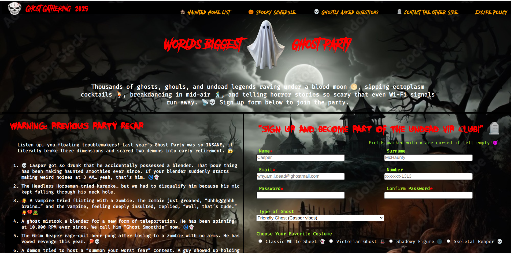

# sign-up-form

<h3 align="center"><b>Sign-up Form</b></h3>

  

    For Illusionary Sign up form
     
     
    <a href="https://yashu483.github.io/sign-up-form/">View Demo</a>
    ·
    <a href="https://www.github.com/yashu483/sign-up-form/issues">Report Bug</a>
    ·
    <a href="https://www.github.com/yashu483/sign-up-form/issues">Request Feature</a>
  

 

<!-- ABOUT THE PROJECT -->
## Preview

 

> **Note**  
>> Application is still under Development

 

## Built With

-    
-    
- 

 

## Tools Used

-    
-   
-   
 

 

## What I learned
* Learnt to create form and basic form validation using building HTML5 features and CSS pseudo classes and Pseudo Elements 
* A lot of minor things

 

<!-- ACKNOWLEDGMENTS -->
## Acknowledgments

* Inspiration by [The Odin Project](https://www.theodinproject.com/)
* Images are taken from Freepik.com
* Icon made by author from link  - used for icon
<a href="https://www.flaticon.com/free-icons/halloween-party" title="halloween party icons">Halloween party icons created by Pixelmeetup - Flaticon</a>

* ghost image used in title for the webpage
<a href="https://www.flaticon.com/free-icons/fear" title="fear icons">Fear icons created by Freepik - Flaticon</a>

* Fonts are downloaded from google fonts

<!-- LICENSE -->
## License

- Distributed under the MIT License. See `LICENSE` for more information.

 

